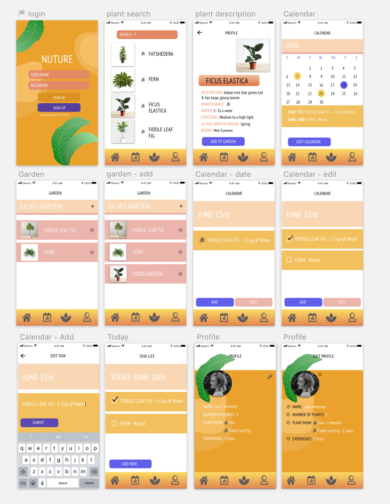
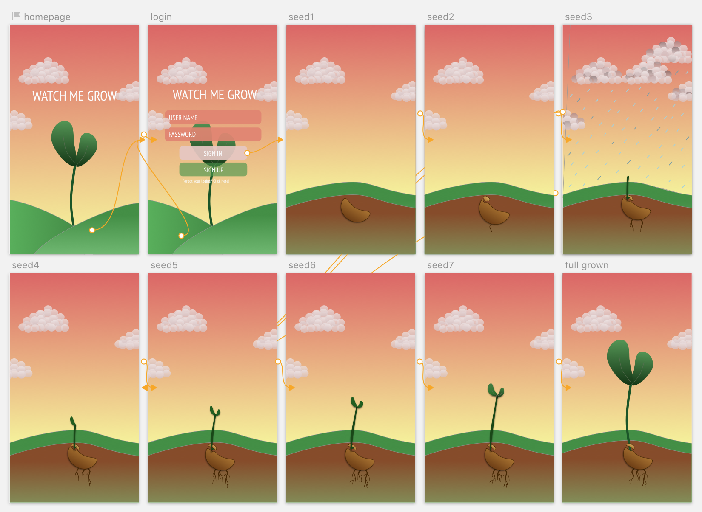

# _
Nurture Me
_

#### _**
By: Julia Sheremet
**_

  

## View Live portfolio application:
https://

## Application Planning
* <a href="/capstone-project-proposal.md">Independent Capstone Project Proposal</a>
* <a href="/stateNotes.md">Notes on Movement of State in Application</a>
* <a href="https://github.com/juliajessica/React-Capstone/blob/master/src/assets/imgs/componentTree.jpeg?raw=true">Component Tree</a>
* <a href="/capstone-project-proposal.md">Create React App Original Notes</a>

| Sketch Application |
| :------- |
|  |

| Parallax |
| :------- |
|  |

## Description

_This webpage application is designed for users to search for plants they're interested in learning about and discover care instructions and details on how to nurture those particular plants._

## Setup/Installation Requirements :computer:

* Clone repository on your local computer.
* In the project directory, you can run:
### `npm start`

Runs the app in the development mode. 
Open [http://localhost:3000](http://localhost:3000) to view it in the browser.

| Features | Status |
|:----------|:----------|
| Login: User can log into their profile | In Progress |
| Login: User can sign up for an account | In Progress |  
| Homepage: User can search for plants to see further details on care instructions | Complete |
| Footer Component: User can access the footer to view homepage, calendar, add plant to their garden, and their profile page | Complete |
| Add Component: User can view all plants in their garden box and add or remove them | In Progress |
| Profile Component: User can view/edit their profile and make any changes to update it | In Progress |

| Future Features | Status |
|:----------|:----------|
| Pull from a larger database to obtain more information on plants: https://uofi.app.box.com/v/usdaplants/file/54438714597 | In Progress |
| Calendar Component: User can access the Calendar and view watering and fertilizing scheduled dates for their plants | In Progress |
| Calendar Component: User will be able to remove tasks off the calendar once they are complete | In Progress |
| Add Component: If the user doesn't know the type of plate they will be able to take a photo of their plant to search the database for more information | In Progress |
| Add Parallax Features on the Homepage |  |

## Known Bugs

_Feel free to email me at [juliajessicasher@gmail.com](mailto:juliajessicasher@gmail.com) if you run into any issues or have questions, ideas or concerns. Please enjoy and feel free to share your opinion, constructive criticism, or comments of my work. :+1:_

## Technologies Used

| Libraries and Languages |
| :------------ |
| React, Redux, React-Redux, JSX |
| Webpack, Babel |
| CSS(Sass) & Bootstrap |
| JavaScript (JQuery) |
| React-Calendar, React-Modal |

### License

Copyright (c) 2018 ****_Julia Sheremet_****

Permission is hereby granted, free of charge, to any person obtaining a copy of this software and associated documentation files (the "Software"), to deal in the Software without restriction, including without limitation the rights to use, copy, modify, merge, publish, distribute, sublicense, and/or sell copies of the Software, and to permit persons to whom the Software is furnished to do so, subject to the following conditions:

The above copyright notice and this permission notice shall be included in all copies or substantial portions of the Software.
